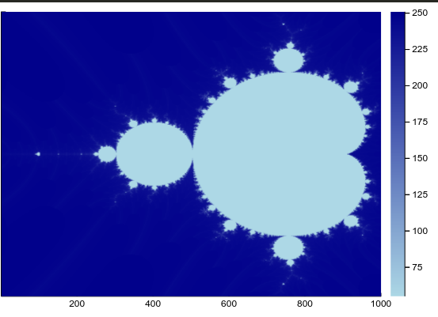
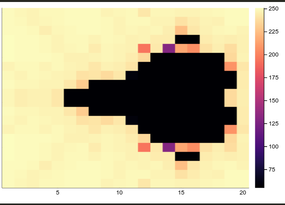

# Mandelbrot

[Look at my blog for an explanation](https://www.subhadityamukherjee.me/article/2020/07/09/mandelbrot.html)

- Have you heard of the Mandelbrot set?
- I try to code it in Julia and explain how it works.

- 
- 
